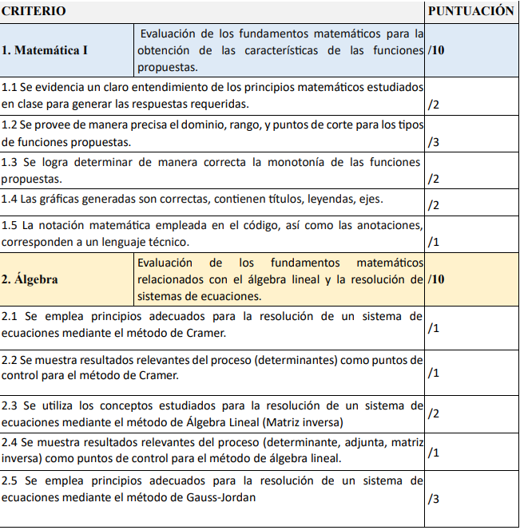
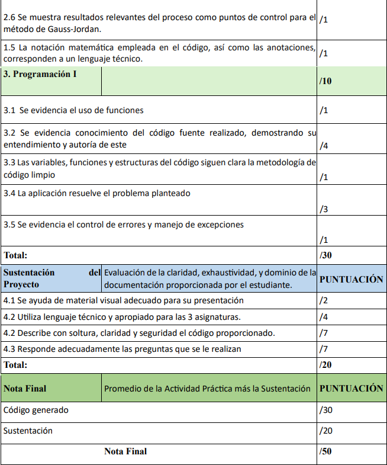

# Proyecto Integrador - PUCETEC

## Grupo 1

- Julian Solorzano
- Jeyson Mueses

El proyecto integrador busca fomentar el aprendizaje interdisciplinario mediante la combinación de
conocimientos de Matemática, Álgebra y Programación, promoviendo el desarrollo de habilidades
analíticas y de resolución de problemas en un contexto práctico.

Los estudiantes aplicarán conceptosfundamentales de las tres asignaturas para crear un programa en Python que permita explorar propiedades de funciones matemáticas y resolver sistemas de ecuaciones.

Este desafío implica no solo la implementación de algoritmos desde cero, sino también la capacidad de interpretar resultados y comunicar efectivamente el proceso y los hallazgos. Con este enfoque, se pretende reforzar competencias técnicas y fomentar el trabajo colaborativo, la creatividad y el pensamiento crítico en un entorno de aprendizaje aplicado.

Los sistemas de ecuaciones y las funciones matemáticas desempeñan un papel fundamental en la
ciencia de la computación, ya que son herramientas esenciales para modelar y resolver problemas
complejos en diversas áreas. Los sistemas de ecuaciones lineales, por ejemplo, son ampliamente
utilizados en algoritmos de optimización, gráficos computacionales y machine learning, permitiendo
representar y solucionar relaciones entre variables interdependientes. Por otro lado, las funciones
matemáticas, ya sean lineales, cuadráticas o cúbicas, son la base para estudiar el comportamiento de datos, modelar fenómenos naturales y diseñar algoritmos eficientes. En el desarrollo de software y simulaciones, estas herramientas permiten abordar problemas de análisis, predicción y control,
demostrando cómo las matemáticas actúan como un lenguaje universal que conecta la teoría con la
práctica en la computación.

- Problema:
  Usted es parte de un equipo de desarrolladores de software está diseñando una aplicación para
  analizar y visualizar datos financieros. Como parte del módulo de análisis matemático, se requiere
  implementar un programa que permita a los usuarios:

Modelar funciones matemáticas: Dado un conjunto de datos financieros, la tendencia puede ser
aproximada mediante una regresión que permite generar una función (lineal, cuadrática o cúbica).
El programa debe permitir introducir hasta tres funciones a la vez, calcular propiedades clave de
cada función, como el dominio, rango, monotonía, puntos de corte con los ejes, paridad, y gráfica
(en caso de que se ingrese más de una función, se deberá generar un diagrama con sugráficas)
Resolver sistemas de ecuaciones: Para optimizar los recursos financieros de una empresa, el
programa debe incluir la funcionalidad para resolver sistemas de ecuaciones 3x3 que representen
restricciones o relaciones entre variables económicas. Esto debe realizarse mediante tres métodos
diferentes: Regla de Cramer, Álgebra Lineal y Gauss-Jordan, proporcionando tanto resultados
intermedios como soluciones finales.

- Restricciones:
  No se permite el uso de funciones predefinidas de bibliotecas de Python para los cálculos
  específicos (excepto en el caso de gráficas de funciones cúbicas).
  Los métodos implementados deben ser desarrollados desde cero, aplicando los conceptos
  matemáticos y algorítmicos aprendidos.
  Este proyecto simula el desarrollo de un sistema de soporte para la toma de decisiones, donde la
  precisión y la comprensión del comportamiento de las funciones y sistemas de ecuaciones son
  esenciales para garantizar resultados confiables en un entorno empresarial.

